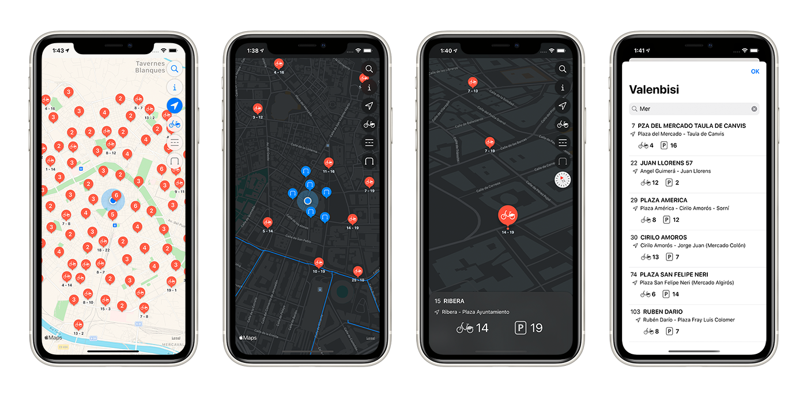

    

# BiciValencia App

A simple iOS app that displays information on bikes in Valencia. It can be downloaded on the [App Store](https://apps.apple.com/app/bicivalencia/id1529249281).

    

## Contents
- [Outline](#outline)
- [Architecture](#architecture)
- [Features](#features)
- [Support](#support)

## Outline

The app shows a map centered in Valencia, displaying the Valenbisi stations, and the bike network.

The data is provided by the Valencia City Council's open data portal to show the lastest available information.

The map contains different buttons to handle the user location, filter out information as needed, and check app information.

Tap on one of the markers to select a station and show its details.

The map has a boundary and a zoom range set, to make the navigation easier to the user and to focus only on the area that displays the bike information.

## Architecture
The application employs the Model-View-ViewModel pattern, giving a clean separation of concerns between the views and the data.

This pattern is especially useful because the app is developed using SwiftUI and Combine, which makes the app reactive.

The application makes use of protocols, which makes the app more testable using the unit and integrations tests that are included in its own target.

## Features
- Xcode 11 and Swift 5
- MVVM
- MapKit and CoreLocation
- SwiftUI and Combine
- URLSession
- REST API integration and JSON
- Swift Package Manager
- Unit and integration tests
- Dark mode

## Support
If you have any query or suggestion, please do not hesitate to contact us at bicivalencia.app@gmail.com
